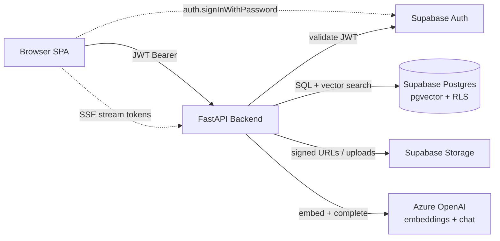
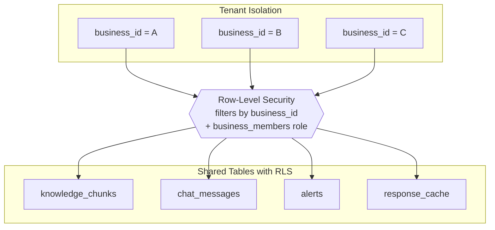

# RAG Factory — Plan & Task Tracker

> **Purpose.** Living execution tracker for the RAG Factory project. Use this file day-to-day; keep [STEPS.md](STEPS.md) as the detailed reference guide (SQL, code snippets, explanations).
>
> **How to use.** Tick boxes as you complete work. Do not move to the next phase until its **Definition of Done** is fully green.

---

## Status

**Overall:** `3 / 13` phases complete  _(Phase 0 through Phase 12; Phase 1 DB apply is on you)_

| # | Phase | Status |
|---|---|---|
| 0 | Project Init & Env | [x] |
| 1 | Supabase Schema + RLS + pgvector | [~] |
| 2 | Backend Foundation | [x] |
| 3 | Authentication | [ ] |
| 4 | Super Admin Dashboard | [ ] |
| 5 | RAG Engine Core | [ ] |
| 6 | Knowledge Base Management | [ ] |
| 7 | Business Admin Dashboard | [ ] |
| 8 | User Chat Portal | [ ] |
| 9 | Integration Testing & E2E | [ ] |
| 10 | Embeddable Widget | [ ] |
| 11 | UI Polish & A11y | [ ] |
| 12 | Documentation | [ ] |

### Legend

| Mark | Meaning |
|---|---|
| `[ ]` | Not started |
| `[~]` | In progress |
| `[x]` | Done |
| `[!]` | Blocked (add a note on the same line) |

---

## 1. Confirmed Decisions

- **Frontend language:** TypeScript (`.tsx`, strict mode)
- **UI kit:** shadcn/ui (installed via CLI) + Tailwind CSS v4
- **Testing:** automated + manual — pytest, Vitest, Playwright
- **Scope of this file:** companion to [STEPS.md](STEPS.md); STEPS.md remains unchanged
- **Deployment target:** local development only for now

---

## 2. Tech Stack (final, post-upgrades)

| Layer | Choice | Notes / swap from STEPS.md |
|---|---|---|
| **Backend runtime** | Python 3.11+, FastAPI, Uvicorn | unchanged |
| **Python package manager** | `uv` | replaces `pip` — 10–100× faster installs + lockfile |
| **Supabase client** | `supabase-py` (anon + service) | unchanged |
| **Postgres / Vectors** | Supabase Postgres + `pgvector` HNSW | unchanged |
| **LLM provider** | Azure OpenAI (embeddings + completions) | unchanged |
| **Background jobs** | FastAPI `BackgroundTasks` | **new** — prevents ingestion from blocking API |
| **Logging** | `structlog` (JSON) | **new** — replaces ad-hoc prints |
| **Auth** | Supabase Auth (JWT) | unchanged |
| **Frontend framework** | React 18 + Vite + TypeScript | **TS** instead of JSX |
| **Node package manager** | `pnpm` | replaces `npm` — faster, disk-efficient |
| **UI components** | shadcn/ui + Tailwind v4 + Radix primitives | **shadcn** added |
| **Forms** | React Hook Form + Zod | **new** — validation + type safety |
| **Data fetching** | TanStack Query v5 | **new** — caching, retries, loading states |
| **Global state** | Zustand | **new** — for auth + current business only |
| **Icons** | `lucide-react` | unchanged |
| **Routing** | `react-router-dom` v6 | unchanged |
| **DB migrations** | Supabase CLI (`supabase/migrations/`) | **new** — files instead of raw SQL pasting |
| **Linters / formatters** | `ruff` (Python), `eslint` + `prettier` (TS) | **new** |
| **Pre-commit** | `pre-commit` framework | **new** |
| **Testing — backend** | `pytest`, `pytest-asyncio`, `httpx` TestClient | **new** |
| **Testing — frontend unit** | `Vitest` + `@testing-library/react` | **new** |
| **Testing — E2E** | `Playwright` | **new** |
| **Error tracking** | Sentry (optional, deferred) | **new, flagged** |

---

## 3. Architecture Overview

### Request flow



### Multi-tenant isolation



---

## 4. Data Model Cheat-Sheet

Full schema lives in [STEPS.md Phase 1](STEPS.md). Summary:

| Table | Purpose |
|---|---|
| `businesses` | Tenants — one row per business (name, slug, settings JSONB, `is_active`). |
| `business_members` | Maps `user_id` → `business_id` with role (`super_admin` / `admin` / `viewer`). |
| `user_profiles` | Extends `auth.users` with `full_name`, `is_super_admin`. Auto-created by trigger. |
| `knowledge_chunks` | RAG vector store (content, `vector(1536)`, `fts tsvector`, `content_hash`, `business_id`). |
| `conversations` | Chat threads (per business, per user or anonymous session). |
| `chat_messages` | Individual messages (role, content, confidence, sources JSONB, `is_failed`). |
| `alerts` | Per-business broadcast alerts injected into the RAG prompt when active. |
| `response_cache` | Query-hash → cached response, 24-hour TTL, per business. |

Supporting SQL:
- `search_knowledge(business_id, embedding, query_text, match_count, threshold)` — hybrid search function (70% semantic + 30% BM25-style).
- Storage bucket `uploads` — private, 50 MB cap, PDF/TXT/MD.

---

## 5. UI / UX Design System

Single source of truth for visual decisions. All design tokens live in `frontend/src/index.css` as CSS variables.

### 5.1 Color tokens (Tailwind v4 `@theme` directive)

Uses shadcn/ui's HSL convention. Dark theme is default; light theme is an override on `.light`.

```css
@theme {
  --color-background: hsl(240 10% 4%);
  --color-foreground: hsl(210 20% 98%);
  --color-surface:    hsl(240 6% 10%);
  --color-border:     hsl(240 4% 16%);
  --color-muted:      hsl(240 4% 22%);
  --color-muted-fg:   hsl(240 5% 65%);

  --color-primary:    hsl(239 84% 67%);  /* indigo-500 */
  --color-primary-fg: hsl(210 20% 98%);

  --color-accent:     hsl(262 83% 58%);  /* violet */
  --color-destructive:hsl(0   72% 51%);
  --color-success:    hsl(142 71% 45%);
  --color-warning:    hsl(38  92% 50%);
  --color-ring:       hsl(239 84% 67%);
}
```

### 5.2 Typography

- **Font:** Inter (self-hosted via `@fontsource/inter`).
- **Scale:** `text-xs` (12), `text-sm` (14), `text-base` (16), `text-lg` (18), `text-xl` (20), `text-2xl` (24), `text-3xl` (30), `text-4xl` (36).
- **Line height:** 1.5 body, 1.2 headings.
- **Mono font:** JetBrains Mono for code/chunk content.

### 5.3 Spacing, radius, elevation

- **Spacing scale:** 4 / 8 / 12 / 16 / 24 / 32 / 48 / 64 px (Tailwind defaults).
- **Radius:** `--radius: 0.5rem` (8 px). Cards `rounded-lg`, inputs `rounded-md`, pills `rounded-full`.
- **Shadows:** avoid heavy shadows; use subtle `0 1px 2px rgb(0 0 0 / 0.3)` + border.

### 5.4 Motion

- **Default transition:** 150 ms `ease-out` (hover, focus, color).
- **Modals / drawers:** 300 ms `ease-out` (enter), 200 ms `ease-in` (exit).
- **Respect `prefers-reduced-motion: reduce`** — disable non-essential transitions.

### 5.5 shadcn/ui components per phase

Install with `pnpm dlx shadcn@latest add <names>` as you reach each phase — don't pre-install everything.

| Phase | Components to add |
|---|---|
| 3 (Auth) | `button`, `input`, `label`, `card`, `alert`, `form` |
| 4 (Super Admin) | `dialog`, `dropdown-menu`, `table`, `toast` (via `sonner`), `tabs`, `select`, `switch`, `slider` |
| 6 (Knowledge Base) | `progress`, `accordion`, `textarea`, `popover`, `command` |
| 7 (Business Admin) | `badge`, `skeleton`, `tooltip` |
| 8 (Chat Portal) | `scroll-area`, `avatar`, `separator`, `sheet` (mobile sidebar) |

### 5.6 Page archetypes

- **Auth pages** — centered `card`, max-width 400 px, glassmorphism backdrop (`backdrop-blur-xl bg-surface/60`).
- **Dashboard pages** — persistent 240 px sidebar + main content with a breadcrumb header.
- **Chat portal** — full-bleed layout, sticky input at bottom, messages in a scroll area, alert banner up top.
- **Empty states** — illustration placeholder + one-line explanation + primary CTA.

### 5.7 Accessibility baseline (WCAG AA)

- Contrast: all text ≥ 4.5:1 against its background (verify with Chrome DevTools).
- Visible focus ring on every interactive element (default shadcn `focus-visible:ring-2 ring-ring`).
- Icon-only buttons require `aria-label`.
- Forms: every `<input>` paired with `<label>`; errors announced via `aria-describedby`.
- Keyboard: full keyboard nav; Escape closes modals; Tab order matches visual order.
- Screen reader: live region (`role="status"`) for toast + streaming chat.

---

## 6. Repo Layout

```
RAG-Factory/
├── backend/
│   ├── app/
│   │   ├── __init__.py
│   │   ├── main.py
│   │   ├── config.py
│   │   ├── dependencies.py
│   │   ├── logging.py                  # NEW: structlog config
│   │   ├── api/
│   │   │   ├── auth.py
│   │   │   ├── super_admin.py
│   │   │   ├── business_admin.py
│   │   │   ├── chat.py
│   │   │   └── knowledge.py
│   │   ├── core/
│   │   │   ├── llm_router.py
│   │   │   ├── chunker.py
│   │   │   ├── ingestor.py
│   │   │   ├── searcher.py
│   │   │   ├── reranker.py             # NEW (optional, Phase 5.9)
│   │   │   ├── rag_brain.py
│   │   │   ├── pdf_parser.py
│   │   │   ├── scraper.py
│   │   │   └── text_cleaner.py
│   │   ├── models/                     # Pydantic schemas
│   │   └── db/
│   │       ├── supabase_client.py
│   │       └── queries.py
│   ├── tests/                          # NEW: pytest
│   │   ├── conftest.py
│   │   ├── test_config.py
│   │   ├── test_dependencies.py
│   │   ├── test_api_auth.py
│   │   ├── test_api_super_admin.py
│   │   ├── test_core_chunker.py
│   │   ├── test_core_searcher.py
│   │   └── test_core_rag_brain.py
│   ├── pyproject.toml                  # NEW: uv + ruff + pytest config
│   ├── uv.lock                         # NEW
│   ├── .env.example
│   └── .env
├── frontend/
│   ├── public/
│   ├── src/
│   │   ├── main.tsx
│   │   ├── App.tsx
│   │   ├── index.css
│   │   ├── lib/
│   │   │   ├── supabase.ts
│   │   │   ├── api.ts                  # typed fetch wrapper
│   │   │   ├── query-client.ts         # TanStack Query
│   │   │   ├── utils.ts
│   │   │   └── validators/             # NEW: Zod schemas
│   │   │       ├── auth.ts
│   │   │       ├── business.ts
│   │   │       └── chat.ts
│   │   ├── stores/                     # NEW: Zustand
│   │   │   ├── auth-store.ts
│   │   │   └── business-store.ts
│   │   ├── hooks/
│   │   ├── types/                      # NEW: shared TS types
│   │   │   ├── api.ts
│   │   │   └── models.ts
│   │   ├── components/
│   │   │   ├── ui/                     # NEW: shadcn copies
│   │   │   ├── layout/
│   │   │   ├── chat/
│   │   │   ├── knowledge/
│   │   │   └── common/
│   │   ├── pages/
│   │   │   ├── auth/
│   │   │   ├── super-admin/
│   │   │   ├── business-admin/
│   │   │   └── chat/
│   │   └── context/
│   ├── tests/                          # NEW: Vitest unit tests
│   ├── e2e/                            # NEW: Playwright
│   │   ├── auth.spec.ts
│   │   ├── super-admin.spec.ts
│   │   └── chat.spec.ts
│   ├── components.json                 # NEW: shadcn config
│   ├── package.json
│   ├── pnpm-lock.yaml
│   ├── tsconfig.json
│   ├── vite.config.ts
│   ├── playwright.config.ts            # NEW
│   ├── vitest.config.ts                # NEW
│   └── .env
├── supabase/                           # NEW
│   └── migrations/
│       ├── 20260418000001_extensions.sql
│       ├── 20260418000002_businesses.sql
│       ├── 20260418000003_business_members.sql
│       ├── 20260418000004_knowledge_chunks.sql
│       ├── 20260418000005_conversations.sql
│       ├── 20260418000006_chat_messages.sql
│       ├── 20260418000007_alerts.sql
│       ├── 20260418000008_response_cache.sql
│       ├── 20260418000009_user_profiles.sql
│       ├── 20260418000010_rls_policies.sql
│       └── 20260418000011_search_knowledge_fn.sql
├── widget/
│   ├── widget.js
│   └── widget.css
├── .pre-commit-config.yaml             # NEW
├── .gitignore
├── README.md
├── STEPS.md
└── PLAN.md                             # this file
```

---

## 7. Phase-by-Phase Checklist

Commit message format: `Phase N: <description>` (matches STEPS.md).

---

### Phase 0 — Project Init & Environment  `[x]`

**Objective.** Scaffold repo, install toolchains, initialise git.

**Prereqs:** `[x]` none.

#### Tasks

- `[x]` 0.1 Create project root, `git init`, add `.gitignore`
  - `[x]` Include Python (`venv/`, `__pycache__/`, `.env`), Node (`node_modules/`, `dist/`), IDE, OS patterns
- `[x]` 0.2 Install system tooling
  - `[x]` Python 3.11+ confirmed (3.12.10)
  - `[x]` Node 18+ confirmed (v22.22)
  - `[x]` Install `uv` (0.8.22)
  - `[x]` Install `pnpm` (10.33)
  - `[ ]` Install Tesseract OCR (deferred — only needed for scanned-PDF OCR in Phase 5)
- `[x]` 0.3 Backend scaffold
  - `[x]` Create `backend/app/{api,core,models,db}/` with `__init__.py`
  - `[x]` `backend/pyproject.toml` with dependencies from STEPS.md plus `structlog`, `pytest`, `pytest-asyncio`, `ruff`, `httpx`, `slowapi`, `tiktoken`
  - `[x]` `uv sync` — creates `.venv`, installs everything
  - `[x]` Configure `ruff` in `pyproject.toml` (line-length 100, target py311)
  - `[x]` Configure `pytest` in `pyproject.toml` (asyncio mode auto, testpaths `tests`)
- `[x]` 0.4 Frontend scaffold
  - `[x]` `pnpm create vite frontend --template react-ts`
  - `[x]` `pnpm add react-router-dom @supabase/supabase-js axios lucide-react @tanstack/react-query zustand react-hook-form zod @hookform/resolvers sonner clsx tailwind-merge class-variance-authority`
  - `[x]` `pnpm add -D tailwindcss @tailwindcss/vite tw-animate-css vitest @vitest/ui jsdom @testing-library/react @testing-library/jest-dom @testing-library/user-event @playwright/test prettier eslint-config-prettier`
  - `[x]` shadcn init equivalent — `components.json` + `lib/utils.ts` + CSS variables in `index.css`
  - `[x]` Configure Tailwind v4 in `vite.config.ts` + `src/index.css` (dark-mode tokens, `@theme inline`)
  - `[x]` Vite proxy `/api` → `http://localhost:8000`
  - `[x]` Configure `tsconfig.json` strict mode, path aliases (`@/*` → `src/*`)
- `[x]` 0.5 `.env.example` files
  - `[x]` `backend/.env.example` (Supabase + Azure OpenAI + app settings — see STEPS.md Phase 0.8)
  - `[x]` `frontend/.env.example` with `VITE_*` vars
- `[x]` 0.6 Dev tooling
  - `[x]` `.pre-commit-config.yaml` with ruff, prettier, eslint
  - `[ ]` `pre-commit install` (deferred — user runs locally once `pip install pre-commit`)
  - `[x]` ESLint + Prettier config in `frontend/`

#### Testing

Automated:
- `[x]` `cd backend && uv run pytest` — 1 test passed (`test_health`)
- `[x]` `cd frontend && pnpm test` — 4 tests passed (`cn()` suite)
- `[x]` `cd frontend && pnpm typecheck` — strict mode green
- `[x]` `cd frontend && pnpm build` — Vite build succeeds (19 modules, 15 kB CSS)
- `[x]` `cd frontend && pnpm lint && pnpm format:check` — clean

Manual:
- `[x]` `cd backend && uv run python -c "import fastapi; ..."` works (fastapi 0.136.0)
- `[ ]` `cd frontend && pnpm dev` starts Vite on :5173 (user verifies visually)
- `[x]` `git status` — no `node_modules/`, no `.venv/`, no `.env` tracked (after `git init`)

#### Definition of Done

- `[x]` All tasks checked (except two deferred user-system items)
- `[x]` All tests green
- `[ ]` `git add -A && git commit -m "Phase 0: Project scaffold, dependencies, and environment setup"` (next step)

---

### Phase 1 — Supabase Schema + RLS + pgvector  `[~]`

**Objective.** Provision Supabase project, enable pgvector, apply schema + RLS + helper functions via migration files.

**Prereqs:** `[x]` Phase 0 complete.

#### Tasks

- `[x]` 1.1 Create Supabase project (region close to you)
  - `[x]` Copy URL, anon/publishable key, service role key, DB connection string → `backend/.env` (local)
  - `[x]` Copy URL + key → `frontend/.env` (local)
- `[~]` 1.2 Supabase CLI setup (optional if using `apply_migrations.py`)
  - `[ ]` Install Supabase CLI (`npx supabase` works without global install)
  - `[ ]` `supabase login` + `supabase link --project-ref <ref>` (for `supabase db push`)
- `[x]` 1.3 Create migration files in `supabase/migrations/` (12 files, STEPS.md Phase 1)
  - `[x]` `20260418120000_enable_pgvector.sql`
  - `[x]` `20260418120001_create_businesses.sql`
  - `[x]` `20260418120002_create_business_members.sql`
  - `[x]` `20260418120003_create_knowledge_chunks.sql` (HNSW + FTS)
  - `[x]` `20260418120004_create_conversations.sql`
  - `[x]` `20260418120005_create_chat_messages.sql`
  - `[x]` `20260418120006_create_alerts.sql`
  - `[x]` `20260418120007_create_response_cache.sql`
  - `[x]` `20260418120008_create_user_profiles_and_trigger.sql`
  - `[x]` `20260418120009_enable_rls_policies.sql`
  - `[x]` `20260418120010_create_search_knowledge_function.sql`
  - `[x]` `20260418120011_storage_uploads_bucket.sql`
- `[x]` 1.3b `npx supabase init` → `supabase/config.toml` in repo
- `[x]` 1.3c `backend/scripts/apply_migrations.py` — applies migrations via `DATABASE_URL` + `sqlparse` (IPv6-friendly `hostaddr` on Windows)
- `[ ]` 1.4 Apply migrations **on your machine** (needs outbound TCP to Postgres; some networks block `:5432`)
  - `[ ]` **Option A:** `cd backend && uv sync && uv run python scripts/apply_migrations.py`
  - `[ ]` **Option B:** `npx supabase db push` (after `supabase link`)
  - `[ ]` **Option C:** paste each file in order into **SQL Editor** in the Supabase dashboard
  - `[ ]` Verify in Dashboard → **Database** → **Tables**
- `[x]` 1.5 Storage bucket `uploads` (migration `..._storage_uploads_bucket.sql`)
- `[ ]` 1.6 Create super-admin user
  - `[ ]` Add user via Supabase Dashboard → **Authentication** → **Users**
  - `[ ]` SQL: `UPDATE public.user_profiles SET is_super_admin = TRUE WHERE email = 'your@email';`

#### Testing

Automated:
- `[x]` Default `uv run pytest` — health test only (no live DB)
- `[ ]` Optional live check: `RUN_LIVE_DB=1 uv run pytest backend/tests/test_db_integration.py -m integration`

Manual (after 1.4 succeeds):
- `[ ]` `SELECT * FROM pg_extension WHERE extname = 'vector'` → 1 row
- `[ ]` RLS enabled on all 8 public tables
- `[ ]` HNSW index on `knowledge_chunks.embedding`
- `[ ]` `SELECT * FROM search_knowledge(gen_random_uuid(), array_fill(0::float, ARRAY[1536])::vector(1536), '', 1, 0.0);` — empty result, no error
- `[ ]` Storage → bucket `uploads` exists, private

#### Definition of Done

- `[ ]` Migrations applied on hosted Supabase + manual checks above
- `[x]` Migration SQL + apply script committed to git
- `[ ]` `git commit -m "Phase 1: Supabase schema, pgvector, RLS policies, and storage"` (pending push after you verify apply)

---

### Phase 2 — Backend Foundation  `[x]`

**Objective.** FastAPI app with config, Supabase clients, auth dependencies, structured logging, health endpoint.

**Prereqs:** `[x]` Phase 0 complete · `[~]` Phase 1 (schema applied on hosted DB).

#### Tasks

- `[x]` 2.1 `app/config.py` (Pydantic v2 `Settings` + `get_settings()` + `lru_cache`)
- `[x]` 2.2 `app/db/supabase_client.py` — `supabase` + `supabase_admin`
- `[x]` 2.3 `app/dependencies.py` — `get_current_user`, `require_super_admin`, `require_business_admin(business_id)`, `get_optional_user`
- `[x]` 2.3b `app/errors.py` — structured `{"error":{code,message,details?}}` via `HTTPException` handler
- `[x]` 2.4 `app/logging.py` — structlog (JSON non-TTY, console TTY)
- `[x]` 2.5 `app/main.py` — CORS, `X-Request-ID` middleware, lifespan (logging + supabase import), `/api/health`, `/api/health/db`, global exception handler, commented router stubs

#### Testing

Automated:
- `[x]` `tests/test_config.py`
- `[x]` `tests/test_dependencies.py` (mocked Supabase auth)
- `[x]` `tests/test_main.py` — OpenAPI + `/api/health` + `/api/health/db` shape
- `[x]` `backend/.env.test` + conftest load order

Manual:
- `[ ]` `uv run uvicorn app.main:app --reload --port 8000` — verify locally with real `.env`
- `[ ]` Wrong JWT on a protected route — deferred to Phase 3 (no auth routes yet)

#### Definition of Done

- `[x]` All tests green, `ruff check` passes
- `[x]` Git commit + push on `main`

---

### Phase 3 — Authentication  `[ ]`

**Objective.** Auth API routes + React auth context + protected routes.

**Prereqs:** `[x]` Phase 2 complete.

#### Tasks

**Backend**
- `[ ]` 3.1 `app/models/auth.py` — `SignupRequest`, `LoginRequest`, `UserProfile`
- `[ ]` 3.2 `app/api/auth.py` routes
  - `[ ]` `POST /api/auth/signup`
  - `[ ]` `POST /api/auth/login` — returns JWT + profile + memberships
  - `[ ]` `GET /api/auth/me`
  - `[ ]` `POST /api/auth/logout`
- `[ ]` 3.3 Register router in `main.py`

**Frontend**
- `[ ]` 3.4 `pnpm dlx shadcn@latest add button input label card alert form`
- `[ ]` 3.5 `lib/supabase.ts` — typed Supabase client
- `[ ]` 3.6 `lib/api.ts` — Axios instance with auto JWT header + 401 handling
- `[ ]` 3.7 `lib/validators/auth.ts` — Zod schemas for login / signup
- `[ ]` 3.8 `stores/auth-store.ts` — Zustand store (`user`, `session`, `isLoading`, actions)
- `[ ]` 3.9 `context/AuthContext.tsx` — wraps app, listens to `onAuthStateChange`, hydrates store
- `[ ]` 3.10 `pages/auth/LoginPage.tsx` — React Hook Form + Zod + shadcn Form
- `[ ]` 3.11 `pages/auth/SignupPage.tsx`
- `[ ]` 3.12 `components/common/ProtectedRoute.tsx`
  - `[ ]` Redirect to `/login` if no session
  - `[ ]` Role gate: `requireSuperAdmin` prop
  - `[ ]` Loading state while hydrating
- `[ ]` 3.13 `App.tsx` — React Router setup with all routes from STEPS.md 3.6

#### Testing

Automated:
- `[ ]` Backend: `tests/test_api_auth.py` — signup (201), login (200 + token), me (200), invalid password (401)
- `[ ]` Frontend: `tests/auth-validator.test.ts` — Zod rejects bad email / short password
- `[ ]` Frontend: component test for `LoginPage` — submits valid form, shows error on 401
- `[ ]` E2E: `e2e/auth.spec.ts` — signup → login → see dashboard → logout → redirected

Manual:
- `[ ]` `/signup` form renders with validation errors inline
- `[ ]` New user appears in Supabase Auth + `user_profiles` row auto-created (trigger)
- `[ ]` `/dashboard` without session → redirects to `/login`

#### Definition of Done

- `[ ]` All tests green
- `[ ]` `git add -A && git commit -m "Phase 3: Authentication system (Supabase Auth + React context + protected routes)"`

---

### Phase 4 — Super Admin Dashboard  `[ ]`

**Objective.** Business CRUD + platform stats for super admin.

**Prereqs:** `[ ]` Phase 3 complete.

#### Tasks

**Backend**
- `[ ]` 4.1 `app/models/business.py` — `BusinessCreate`, `BusinessUpdate`, `BusinessResponse`
- `[ ]` 4.2 `app/api/super_admin.py` (all endpoints from STEPS.md 4.1, all protected by `require_super_admin`)
  - `[ ]` `GET /businesses` (with aggregate counts)
  - `[ ]` `POST /businesses` (auto-adds creator as admin member)
  - `[ ]` `GET /businesses/{id}`
  - `[ ]` `PUT /businesses/{id}`
  - `[ ]` `DELETE /businesses/{id}` (soft delete)
  - `[ ]` `GET /stats`
  - `[ ]` `POST /businesses/{id}/members`
  - `[ ]` `DELETE /businesses/{id}/members/{user_id}`
- `[ ]` 4.3 Slug generator helper + uniqueness check

**Frontend**
- `[ ]` 4.4 `pnpm dlx shadcn@latest add dialog dropdown-menu table tabs select switch slider sonner`
- `[ ]` 4.5 `lib/validators/business.ts` — Zod schemas
- `[ ]` 4.6 `hooks/useBusinesses.ts` — TanStack Query hooks (list, detail, create, update, delete)
- `[ ]` 4.7 `components/layout/DashboardLayout.tsx` — sidebar + breadcrumb
- `[ ]` 4.8 `pages/super-admin/DashboardPage.tsx` — 4 stat cards + business grid
- `[ ]` 4.9 `pages/super-admin/CreateBusinessPage.tsx` — full form (STEPS.md 4.3)
- `[ ]` 4.10 `components/super-admin/EditBusinessDialog.tsx`
- `[ ]` 4.11 `components/super-admin/DeleteBusinessDialog.tsx` — AlertDialog confirmation
- `[ ]` 4.12 Toast notifications via `sonner` on every mutation

#### Testing

Automated:
- `[ ]` Backend: `tests/test_api_super_admin.py` — CRUD + access control (non-super-admin → 403)
- `[ ]` Frontend: `DashboardPage.test.tsx` — renders grid, clicking create navigates
- `[ ]` E2E: `e2e/super-admin.spec.ts` — login as super admin → create business → edit → soft-delete

Manual checklist — see STEPS.md Phase 4 testing section.

#### Definition of Done

- `[ ]` All tests green
- `[ ]` `git add -A && git commit -m "Phase 4: Super Admin Dashboard with business CRUD management"`

---

### Phase 5 — RAG Engine Core  `[ ]`

**Objective.** Port the RAG engine from the UTS UniBot reference, replace ChromaDB with pgvector, upgrade to hybrid search, add streaming.

**Prereqs:** `[ ]` Phase 2 complete (can run in parallel with Phase 4).

Reference (read-only): `d:\Subs\sem4\research project\grp-p\src\*.py`.

#### Tasks

- `[ ]` 5.1 `core/llm_router.py`
  - `[ ]` Azure OpenAI client (sync + async via `asyncio.to_thread`)
  - `[ ]` `get_embedding(texts)` → `List[List[float]]`
  - `[ ]` `get_completion(prompt, system_prompt)` → `str`
  - `[ ]` `get_completion_streaming(...)` → async generator of tokens
  - `[ ]` Retries (3 attempts, exponential backoff)
  - `[ ]` Token counting + structured log of cost per call
- `[ ]` 5.2 `core/text_cleaner.py` — port + add restaurant/legal patterns; accept optional `industry`
- `[ ]` 5.3 `core/pdf_parser.py` — port; pymupdf4llm → OCR fallback → `text_cleaner`
- `[ ]` 5.4 `core/scraper.py` — port Jina Reader; 30 s timeout, 2 retries, UA rotation
- `[ ]` 5.5 `core/chunker.py`
  - `[ ]` Port MarkdownHeader → RecursiveCharacter pipeline
  - `[ ]` `chunk_size=1200`, `chunk_overlap=150`
  - `[ ]` Async LLM 10-word summary enrichment (batch)
  - `[ ]` `content_hash = md5(url + content)`
  - `[ ]` Filter `MIN_CHUNK_LENGTH = 50`
- `[ ]` 5.6 `core/ingestor.py`
  - `[ ]` `async def ingest_chunks(chunks, business_id, source_url, source_type) -> int`
  - `[ ]` Use `supabase_admin` to insert with `ON CONFLICT (content_hash) DO NOTHING`
  - `[ ]` Structured log of chunks inserted / skipped
- `[ ]` 5.7 `core/searcher.py`
  - `[ ]` Call `search_knowledge(...)` RPC
  - `[ ]` LLM query expansion (port from reference)
  - `[ ]` Return list with `combined_score`
- `[ ]` 5.8 `core/rag_brain.py`
  - `[ ]` Multi-turn context (last 5 messages)
  - `[ ]` Inject active alerts into prompt
  - `[ ]` Business-aware prompt (custom system_prompt from settings)
  - `[ ]` Cache lookup via `response_cache` before LLM
  - `[ ]` Confidence score (avg relevance of used chunks)
  - `[ ]` `generate_rag_response_streaming(...)` async generator
- `[ ]` 5.9 `core/reranker.py` **(optional, flagged)**
  - `[ ]` Cross-encoder rerank (BGE-reranker-v2-m3 via `sentence-transformers`, or Cohere Rerank if key provided)
  - `[ ]` Called between searcher and rag_brain when enabled via setting

#### Testing

Automated:
- `[ ]` `tests/test_core_chunker.py` — given sample markdown returns expected N chunks, hashes stable
- `[ ]` `tests/test_core_ingestor.py` — inserts N rows then asserts dedup on rerun
- `[ ]` `tests/test_core_searcher.py` — mocked embedding + real RPC returns ordered by `combined_score`
- `[ ]` `tests/test_core_rag_brain.py` — mocked LLM, asserts prompt contains business name, alerts, history
- `[ ]` `tests/test_core_llm_router.py` — retry logic (mock transient failure → success on retry 2)
- `[ ]` `backend/test_rag_core.py` end-to-end manual script (STEPS.md 5 checklist)

Manual: STEPS.md Phase 5 checklist.

#### Definition of Done

- `[ ]` All 8 smoke tests pass end-to-end on a real Supabase project
- `[ ]` `git add -A && git commit -m "Phase 5: RAG engine core - llm_router, chunker, ingestor, searcher, rag_brain (pgvector)"`

---

### Phase 6 — Knowledge Base Management  `[ ]`

**Objective.** Upload / scrape / view / edit / delete chunks per business.

**Prereqs:** `[ ]` Phase 5 complete, `[ ]` Phase 4 complete.

#### Tasks

**Backend**
- `[ ]` 6.1 `app/api/knowledge.py` (all endpoints from STEPS.md 6.1, all protected by business-admin check)
- `[ ]` 6.2 Upload flow — file → Supabase Storage → BackgroundTask: parse → chunk → embed → ingest
  - `[ ]` Return `task_id`, provide `GET /{task_id}/status` for progress polling
- `[ ]` 6.3 Scrape flow — URL → same BackgroundTask pipeline
- `[ ]` 6.4 `models/knowledge.py` — Pydantic schemas (chunk, source, stats)

**Frontend**
- `[ ]` 6.5 `pnpm dlx shadcn@latest add progress accordion textarea popover command`
- `[ ]` 6.6 `hooks/useKnowledge.ts` — list (paginated), sources, mutate
- `[ ]` 6.7 `pages/business-admin/KnowledgeBasePage.tsx`
  - `[ ]` Drag-and-drop upload zone (native HTML5 + `react-dropzone` or custom)
  - `[ ]` URL input with "Scrape" button
  - `[ ]` Progress bar driven by status polling
  - `[ ]` Source accordion (group by source_url)
  - `[ ]` Chunk viewer with markdown render toggle
  - `[ ]` Inline edit → re-embed
  - `[ ]` Find & replace within a chunk
  - `[ ]` Filter by source type + keyword search
  - `[ ]` Pagination (10 sources / page)
  - `[ ]` Batch delete by source

#### Testing

Automated:
- `[ ]` `tests/test_api_knowledge.py` — upload small PDF, assert chunks exist; dedup works; delete cascades
- `[ ]` E2E: `e2e/knowledge.spec.ts` — upload sample PDF, edit chunk, delete source

Manual: STEPS.md Phase 6 checklist.

#### Definition of Done

- `[ ]` All tests green
- `[ ]` `git add -A && git commit -m "Phase 6: Knowledge base management (upload, scrape, edit, delete, search)"`

---

### Phase 7 — Business Admin Dashboard  `[ ]`

**Objective.** Full admin workspace: test chat, alerts, analytics, settings.

**Prereqs:** `[ ]` Phase 6 complete.

#### Tasks

**Backend**
- `[ ]` 7.1 `app/api/business_admin.py` (all endpoints from STEPS.md 7.1)
  - `[ ]` Business detail + stats
  - `[ ]` Settings update
  - `[ ]` Analytics aggregate (query volume, confidence distribution, top queries, cost)
  - `[ ]` Chat logs (paginated + filtered)
  - `[ ]` Failed queries
  - `[ ]` Alerts CRUD
  - `[ ]` Cache purge

**Frontend**
- `[ ]` 7.2 `pnpm dlx shadcn@latest add badge skeleton tooltip`
- `[ ]` 7.3 `pnpm add recharts` (or `@tremor/react`)
- `[ ]` 7.4 `pages/business-admin/BusinessAdminLayout.tsx` — sidebar with 5 sections
- `[ ]` 7.5 `pages/business-admin/AdminChatPage.tsx` — chat UI + debug panel (confidence color, sources, chunk count, response time)
- `[ ]` 7.6 `pages/business-admin/AlertsPage.tsx`
- `[ ]` 7.7 `pages/business-admin/AnalyticsPage.tsx` — stat cards + 3 charts + failed queries table + chat history browser + purge logs
- `[ ]` 7.8 `pages/business-admin/SettingsPage.tsx` — all settings fields + logo upload + danger zone

#### Testing

Automated:
- `[ ]` `tests/test_api_business_admin.py` — stats aggregate correct; alerts CRUD; non-member → 403
- `[ ]` Component tests for AnalyticsPage charts (snapshot)
- `[ ]` E2E: `e2e/business-admin.spec.ts` — create alert → purge cache → verify settings persist

Manual: STEPS.md Phase 7 checklist.

#### Definition of Done

- `[ ]` All tests green
- `[ ]` `git add -A && git commit -m "Phase 7: Business Admin Dashboard (chat test, alerts, analytics, settings)"`

---

### Phase 8 — User Chat Portal  `[ ]`

**Objective.** Public chat interface per business, streaming SSE, multi-turn conversations, rate-limited.

**Prereqs:** `[ ]` Phase 5 complete, `[ ]` Phase 7 complete.

#### Tasks

**Backend**
- `[ ]` 8.1 `app/api/chat.py` (all endpoints from STEPS.md 8.1)
  - `[ ]` `POST /{slug}/message` — non-streaming JSON
  - `[ ]` `GET /{slug}/stream` — `text/event-stream` via `sse-starlette`
  - `[ ]` `GET /{slug}/conversations` (authenticated)
  - `[ ]` `GET /{slug}/conversations/{id}/messages`
  - `[ ]` `GET /{slug}/info` — public business info
  - `[ ]` `GET /{slug}/alerts` — active alerts
- `[ ]` 8.2 Rate limiting **(promoted here from STEPS.md Phase 12)**
  - `[ ]` `pnpm add slowapi` / use `slowapi` middleware
  - `[ ]` 20 req / min per IP per business on `/message` + `/stream`
  - `[ ]` 429 response with `Retry-After`
- `[ ]` 8.3 Chat orchestration — implement full pipeline from STEPS.md 8.2 (cache → alerts → history → hybrid search → prompt → LLM → log → cache)
- `[ ]` 8.4 Anonymous session handling — `session_id` UUID in payload → associated with `conversations.session_id`

**Frontend**
- `[ ]` 8.5 `pnpm dlx shadcn@latest add scroll-area avatar separator sheet`
- `[ ]` 8.6 `pages/chat/ChatPortal.tsx`
  - `[ ]` Business branding (logo, name, primary color from `/info`)
  - `[ ]` Alert banner (dismissible per session via sessionStorage)
  - `[ ]` Scrollable messages area, auto-scroll to bottom
  - `[ ]` Sticky input with auto-resize textarea
  - `[ ]` Typing indicator (3 bouncing dots)
  - `[ ]` Source citations expandable per message
  - `[ ]` Confidence dot (green ≥ 0.3, orange ≥ 0.15, red otherwise)
  - `[ ]` Conversation sidebar (Sheet on mobile, fixed on desktop) — auth users only
  - `[ ]` New conversation button
  - `[ ]` Login gate when `user_login_required`
  - `[ ]` Session-ID generation + persistence in localStorage for anonymous
- `[ ]` 8.7 `hooks/useChatStream.ts` — EventSource wrapper, aborts on unmount, handles reconnection
- `[ ]` 8.8 Mobile responsive pass (sidebar → drawer, compact typography)

#### Testing

Automated:
- `[ ]` `tests/test_api_chat.py` — non-streaming happy path; cache hit; anonymous session; rate limit enforced
- `[ ]` `tests/test_chat_streaming.py` — assert SSE events arrive and complete
- `[ ]` Component test for `ChatPortal` — message send + render
- `[ ]` E2E: `e2e/chat.spec.ts` — anonymous user sends message, receives streamed response, alert banner shows

Manual: STEPS.md Phase 8 checklist.

#### Definition of Done

- `[ ]` All tests green
- `[ ]` `git add -A && git commit -m "Phase 8: User Chat Portal (streaming, conversations, alerts, responsive, rate-limited)"`

---

### Phase 9 — Integration Testing & E2E  `[ ]`

**Objective.** Full-flow validation across phases, bug hunt, performance sanity.

**Prereqs:** `[ ]` Phases 0–8 complete.

#### Tasks

- `[ ]` 9.1 Run end-to-end scenario manually (STEPS.md 9.1)
  - `[ ]` Create "Sydney Burgers"
  - `[ ]` Upload PDF + scrape URL
  - `[ ]` Admin chat test
  - `[ ]` Create emergency alert
  - `[ ]` User portal chat (incognito)
  - `[ ]` Analytics verify
  - `[ ]` Create "UTS University" → verify tenant isolation
- `[ ]` 9.2 Consolidated Playwright E2E suite
  - `[ ]` `e2e/full-flow.spec.ts` — ties all phase specs together as one scenario
  - `[ ]` `playwright.config.ts` — run against local dev servers
- `[ ]` 9.3 Bug-fix checklist (STEPS.md 9.2)
- `[ ]` 9.4 Performance checks (STEPS.md 9.3)
  - `[ ]` Measure KB search, chat response, dashboard load with 100+ chunks
  - `[ ]` Record numbers in this PLAN as baseline

#### Definition of Done

- `[ ]` Full E2E suite passes locally
- `[ ]` Zero critical bugs; non-critical bugs filed as TODOs
- `[ ]` `git add -A && git commit -m "Phase 9: Integration testing and bug fixes"`

---

### Phase 10 — Embeddable Widget  `[ ]`

**Objective.** `<script>`-embeddable chat widget for external sites.

**Prereqs:** `[ ]` Phase 8 complete.

#### Tasks

- `[ ]` 10.1 `widget/widget.js` — vanilla JS, Shadow DOM container, fetches `/api/chat/{slug}/info`
- `[ ]` 10.2 Chat bubble (60 px, business primary color, pulse anim)
- `[ ]` 10.3 Chat panel (400×600, close button, same UI patterns as portal but compact)
- `[ ]` 10.4 `widget/widget.css` — scoped styles
- `[ ]` 10.5 Embed code generator — add section to `SettingsPage.tsx` with copy button
- `[ ]` 10.6 CORS allow-list handling — widget passes origin, backend verifies against business settings
- `[ ]` 10.7 Test harness `widget/demo.html`

#### Testing

Automated:
- `[ ]` E2E: `e2e/widget.spec.ts` — load `demo.html`, open bubble, send message, receive reply

Manual: STEPS.md Phase 10 checklist.

#### Definition of Done

- `[ ]` All tests green
- `[ ]` `git add -A && git commit -m "Phase 10: Embeddable chat widget"`

---

### Phase 11 — UI Polish & Accessibility  `[ ]`

**Objective.** Loading states, animations, error boundaries, a11y, responsive pass.

**Prereqs:** `[ ]` Phase 10 complete.

#### Tasks

- `[ ]` 11.1 Skeleton loaders on every data-fetching page (`Skeleton` component)
- `[ ]` 11.2 `ErrorBoundary.tsx` wrapping every top-level page
- `[ ]` 11.3 Toast notifications standardised via `sonner` (success/error/info)
- `[ ]` 11.4 Micro-animations pass (page fade-in, card hover, button press, chat slide-in, modal scale-in)
- `[ ]` 11.5 A11y audit pass with axe DevTools — fix violations
  - `[ ]` All interactive elements have accessible names
  - `[ ]` Focus ring visible everywhere
  - `[ ]` WCAG AA contrast verified
  - `[ ]` Forms have labels + error announcements
- `[ ]` 11.6 Responsive final check at 1440 / 1280 / 1024 / 768 / 375 / 320 px

#### Testing

Automated:
- `[ ]` `pnpm add -D @axe-core/playwright`
- `[ ]` `e2e/a11y.spec.ts` — run axe on each main route, zero critical violations

Manual: visual QA at each breakpoint.

#### Definition of Done

- `[ ]` Zero axe-critical violations
- `[ ]` `git add -A && git commit -m "Phase 11: UI polish, animations, error handling, accessibility"`

---

### Phase 12 — Documentation  `[ ]`

**Objective.** Ship-ready docs (lighter scope — local only, no Docker for now).

**Prereqs:** `[ ]` Phase 11 complete.

#### Tasks

- `[ ]` 12.1 `README.md`
  - `[ ]` Project overview + screenshots (insert after Phase 11)
  - `[ ]` Architecture mermaid (reuse from this PLAN)
  - `[ ]` Tech stack table
  - `[ ]` Getting Started guide (clone → `uv sync` → `pnpm install` → `supabase db push` → run both servers)
  - `[ ]` Env vars reference
  - `[ ]` Link to `/docs` (auto Swagger) + `/redoc`
  - `[ ]` Troubleshooting section
- `[ ]` 12.2 API docstrings on every endpoint + request/response examples
- `[ ]` 12.3 Extended health checks
  - `[ ]` `GET /api/health/db`
  - `[ ]` `GET /api/health/llm`
  - `[ ]` `GET /api/health/storage`
- `[ ]` 12.4 Expand Risks & Open Questions section in this file with resolutions

Deferred (out of scope now):
- Docker / docker-compose
- Production CORS lockdown
- Deployment guide

#### Testing

- `[ ]` README renders cleanly in VS Code preview and on GitHub
- `[ ]` All 4 health endpoints return healthy
- `[ ]` Swagger shows all endpoints grouped by tag

#### Definition of Done

- `[ ]` `git add -A && git commit -m "Phase 12: Documentation and extended health checks"`

---

## 8. Testing Strategy

### Backend (`pytest`)

- Location: `backend/tests/`
- Runner: `uv run pytest` (async mode auto)
- Fixtures in `conftest.py`:
  - `test_settings` — loads `.env.test` with a dedicated Supabase test project
  - `supabase_admin_client` — module-scoped client
  - `clean_db` — truncates all tables before each test run
  - `super_admin_token`, `business_admin_token`, `anon_session_id`
  - `sample_business`, `sample_chunks` factories
- **Coverage target: 70%** on `app/api/` and `app/core/` modules.
- Mock external calls: `respx` for HTTP (Azure OpenAI, Jina), pytest monkeypatch for Supabase auth.
- Run on every commit via pre-commit hook (fast subset) + full suite on `git push`.

### Frontend units (`Vitest`)

- Location: `frontend/tests/` and co-located `*.test.ts(x)`.
- Runner: `pnpm vitest`.
- Focus areas:
  - Zod validators (`lib/validators/*`)
  - Zustand stores (state transitions)
  - Hooks (`useChatStream`, `useKnowledge`, etc.) via `@testing-library/react-hooks`
  - Small components with branching logic (ProtectedRoute, confidence dot, empty states)
- Snapshot tests for chart components (Analytics).

### E2E (`Playwright`)

- Location: `frontend/e2e/`.
- Runner: `pnpm exec playwright test`.
- One spec per critical flow:
  - `auth.spec.ts` — signup, login, logout
  - `super-admin.spec.ts` — create, edit, soft-delete business
  - `knowledge.spec.ts` — upload PDF, verify chunks, edit, delete
  - `business-admin.spec.ts` — create alert, analytics reflects a test query
  - `chat.spec.ts` — anonymous message → streamed response; alert banner; multi-turn
  - `widget.spec.ts` — embed in demo page, bubble → panel → message
  - `full-flow.spec.ts` — end-to-end scenario from Phase 9
  - `a11y.spec.ts` — axe on each main route
- Playwright starts dev servers automatically (`webServer` config) against a dedicated Supabase test project.

### Manual checklists

Keep STEPS.md per-phase manual checklists as a final smoke test before committing each phase.

---

## 9. Risks & Open Questions

| Risk / Question | Mitigation / Plan |
|---|---|
| **Azure OpenAI cost / quota** — no hard cap from SDK | Log tokens per request via `llm_router`; surface in Analytics; add a soft-cap setting per business later |
| **Large PDF timeouts (>50 MB)** | Supabase Storage cap at 50 MB; ingestion offloaded to `BackgroundTasks`; show user a task-status poll endpoint |
| **Embedding dim lock-in (1536)** | `knowledge_chunks.embedding vector(1536)` is fixed. If we ever change model, migration script must re-embed everything. Document in README. |
| **RLS edge cases for anonymous chat** | Anonymous inserts on `chat_messages` rely on `WITH CHECK (TRUE)` — backend is responsible for validating `business_id`. Cover with tests in Phase 8. |
| **Widget CORS / iframe styling on third-party sites** | Shadow DOM isolates CSS; business can allow-list their origin via Settings. Tested with `demo.html` and one real public site. |
| **Supabase free-tier limits** (500 MB DB, 1 GB storage, 50k monthly MAUs) | Fine for local dev. Revisit when scaling. |
| **Conversation history cost** | Last 5 messages is the hard cap for prompt context. Make it configurable per business if needed. |
| **Reranker latency** | Optional; off by default. If enabled, measure added latency in Phase 9 perf check. |
| **Tesseract OCR availability on Windows** | Document UB-Mannheim install link in README; skip OCR gracefully if binary missing (log warning, proceed with text-only extraction). |
| **Supabase CLI on Windows** | Windows requires scoop or manual install — document in Phase 0. |

---

## 10. Quick Reference

### Commit-message cheat sheet

```
Phase 0: Project scaffold, dependencies, and environment setup
Phase 1: Supabase schema, pgvector, RLS policies, and storage
Phase 2: FastAPI skeleton, Supabase client, auth dependencies
Phase 3: Authentication system (Supabase Auth + React context + protected routes)
Phase 4: Super Admin Dashboard with business CRUD management
Phase 5: RAG engine core - llm_router, chunker, ingestor, searcher, rag_brain (pgvector)
Phase 6: Knowledge base management (upload, scrape, edit, delete, search)
Phase 7: Business Admin Dashboard (chat test, alerts, analytics, settings)
Phase 8: User Chat Portal (streaming, conversations, alerts, responsive, rate-limited)
Phase 9: Integration testing and bug fixes
Phase 10: Embeddable chat widget
Phase 11: UI polish, animations, error handling, accessibility
Phase 12: Documentation and extended health checks
```

### Common commands

```bash
# Backend
cd backend
uv sync                                   # install / update deps
uv run uvicorn app.main:app --reload      # start API on :8000
uv run pytest                             # run all tests
uv run pytest tests/test_api_auth.py -v   # single file
uv run ruff check . && uv run ruff format .

# Frontend
cd frontend
pnpm install
pnpm dev                                  # Vite on :5173
pnpm vitest                               # unit tests (watch)
pnpm exec playwright test                 # E2E tests
pnpm exec playwright test --ui            # E2E with UI
pnpm dlx shadcn@latest add <component>    # add a shadcn component
pnpm lint && pnpm format

# Supabase
supabase login
supabase link --project-ref <ref>
supabase db push                          # apply local migrations to linked project
supabase db diff -f <name>                # generate a new migration from schema diff
supabase migration new <name>             # empty migration file

# Git per phase
git add -A && git commit -m "Phase N: <description>"
```

### Useful SQL snippets

Impersonate a user to test RLS in Supabase SQL Editor:

```sql
SET ROLE authenticated;
SET request.jwt.claims = '{"sub":"<user-uuid>","role":"authenticated"}';
-- ...run your query...
RESET ROLE;
```

Check RLS is enforced:

```sql
SELECT tablename, rowsecurity
FROM pg_tables
WHERE schemaname = 'public';
```

Inspect HNSW index:

```sql
SELECT indexname, indexdef
FROM pg_indexes
WHERE tablename = 'knowledge_chunks';
```

Purge expired cache entries:

```sql
DELETE FROM public.response_cache WHERE expires_at < NOW();
```

---

_End of PLAN.md. Keep this file in sync with reality — tick boxes as you go._
