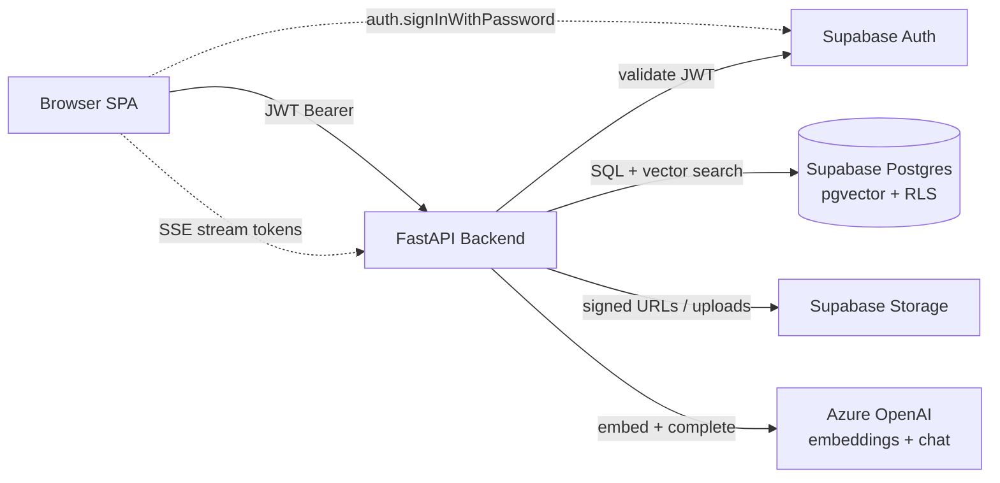
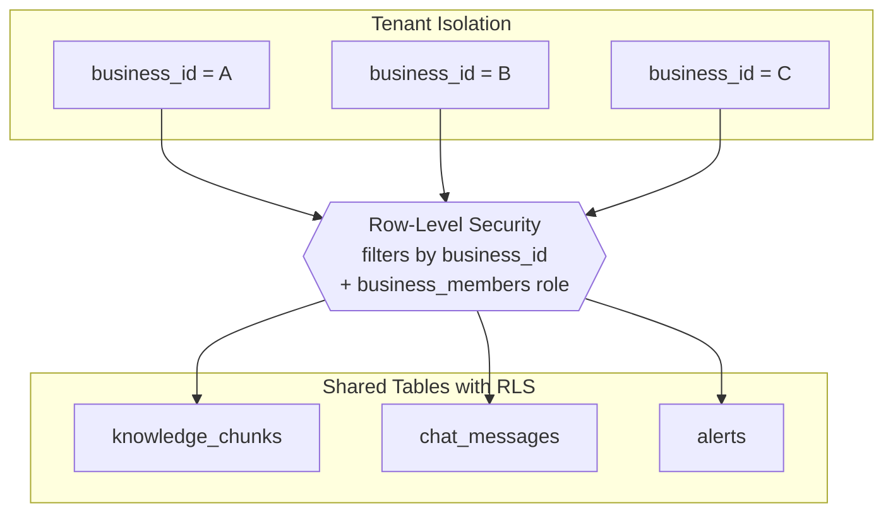

# RAG Factory

Link to Access RagFactory: <https://rag.adityak.codes/>

Multi-tenant Retrieval-Augmented Generation platform. The **platform Super Admin** (you) creates isolated RAG chatbots for different businesses and assigns each one to its own **Business Admin** with dedicated credentials; each business gets its own admin workspace + user chat portal — powered by Azure OpenAI, Supabase (Postgres + pgvector), FastAPI, and React.

---

## Ownership model

- **Super Admin** — the platform owner. Creates businesses, invites Business Admins, manages platform-wide stats, can soft-deactivate any business.
- **Business Admin** — assigned per business by the super admin. Owns a single tenant workspace (`/b/<slug>/admin`) and can manage its profile, settings, and its knowledge base, alerts, and analytics. Cannot see other businesses.
- **End users / visitors** — talk to the business's chatbot at `/b/<slug>`. Anonymous by default; can be gated behind login via the `user_login_required` setting on each business.

When a super admin creates a business, they supply the Business Admin's email (optionally a password and full name). The backend provisions the auth account via Supabase Admin API with `email_confirm=true`, assigns them as `owner_id` and the sole `business_members` admin, and returns **one-time credentials** that the super admin can hand off. Row-level security + a backend `require_business_admin` dependency enforce tenant isolation end-to-end.

---

## Tech Stack

| Layer | Tool |
|---|---|
| Backend | Python 3.11+, FastAPI, `uv`, `structlog`, pytest |
| Frontend | React 19, Vite, TypeScript (strict), Tailwind v4, shadcn/ui, TanStack Query, Zustand, React Hook Form + Zod |
| Database | Supabase Postgres with `pgvector` (HNSW) |
| LLM | Azure OpenAI (embeddings + completions) |
| Storage | Supabase Storage |
| Auth | Supabase Auth (JWT) |
| Testing | pytest, Vitest, Playwright |

---

## Quick Start

### Prerequisites

- Python 3.11+ (`python --version`)
- Node.js 18+ (`node --version`)
- [`uv`](https://github.com/astral-sh/uv) for Python (`pipx install uv` / `winget install astral-sh.uv`)
- [`pnpm`](https://pnpm.io) for Node (`npm i -g pnpm`)
- Git
- (Optional, for scanned-PDF OCR) [Tesseract OCR](https://github.com/UB-Mannheim/tesseract/wiki)

### Backend

```bash
cd backend
uv sync                                      # install deps (creates .venv)
copy .env.example .env                       # Windows; or `cp` on *nix
# edit .env with your Supabase + Azure OpenAI credentials
uv run uvicorn app.main:app --reload --port 8000
```

Health check: <http://localhost:8000/api/health> · Docs: <http://localhost:8000/docs>

### Frontend

```bash
cd frontend
pnpm install
copy .env.example .env
# edit .env with Supabase URL + anon key
pnpm dev
```

App: <http://localhost:5173>

### Tests

```bash
# Backend
cd backend && uv run pytest

# Frontend unit tests
cd frontend && pnpm test

# Frontend E2E (once specs exist from Phase 3+)
cd frontend && pnpm test:e2e

# Frontend typecheck + lint
cd frontend && pnpm typecheck && pnpm lint
```

---

## Architecture Overview

### Request Flow



### Multi-Tenant Isolation



## Contributing

### Team Member Contribution

| Project Workflow Stage | Contribution / Work Completed | Key Deliverables | Contribution By |
|---|---|---|---|
| Project Setup & Planning | Designed the phased workflow for building a multi-tenant RAG platform, including environment setup, milestones, testing strategy, and deployment path. | Project scaffold, phase tracker, setup documentation, Docker/Coolify planning. | Aditya Kubde |
| Database & Tenant Isolation | Implemented Supabase schema with pgvector, business/user relationship tables, chat logs, alerts, knowledge chunk storage. | Secure multi-tenant database foundation with vector search support. | Ashwin Raina |
| Backend Foundation | Built FastAPI backend structure with configuration, logging, Supabase clients, authentication dependencies, error handling, and health checks. | Stable API base with readiness checks for DB, LLM, OCR, and storage. | Aditya Kubde |
| Authentication & Access Control | Added Supabase Auth integration for Super Admin, Business Admin, and optional public users. Enforced role-based access through backend dependencies. | Login/signup flow, protected routes, tenant-aware authorization. | Ayush Onkar |
| Super Admin Workflow | Developed Super Admin features to create businesses, assign dedicated Business Admins, manage tenants. | Business provisioning flow with one-time admin credentials and platform-level control. | Helly Ullasbhai Thakkar |
| RAG Engine Core | Implemented the retrieval pipeline: PDF/web ingestion, text cleaning, chunking, embeddings, hybrid search, confidence thresholding, and streamed LLM responses. | Azure OpenAI + Supabase pgvector RAG engine with fallback handling. | Aditya Kubde |
| Business Admin Workflow | Built tenant admin workspace for settings, knowledge base management, alerts, analytics, and admin-side chat testing. | Business-specific dashboard for managing chatbot behavior and knowledge sources. | Ashwin Raina |
| Public Chat Portal & Widget | Created public chatbot interface and embeddable JavaScript widget for external websites, tenant slug routing and CORS controls. | End-user chat portal, streaming chat API, portable website widget. | Ayush Onkar |
| Testing & Quality Assurance | Added backend unit tests, frontend unit tests, Playwright tests, accessibility checks. | Verified API behavior, UI flows, tenant isolation, widget behavior. | Helly Ullasbhai Thakkar |
| Deployment & Documentation | Prepared Docker/Coolify deployment files and wrote setup guides for local and VPS deployment. | Deployment-ready project with clear setup and readme notes. | Aditya Kubde |
